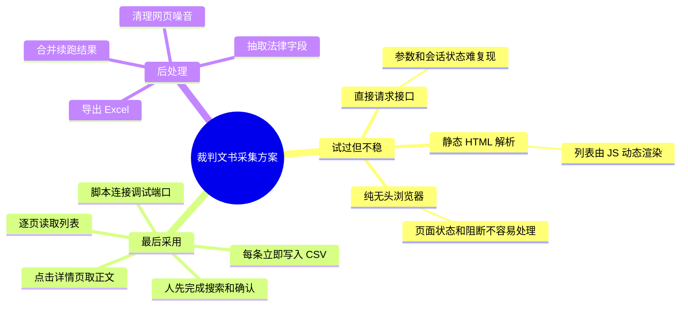

# Court Judgment Extraction Workflow

这个项目来自一次裁判文书数据整理任务。最开始我也想按常规爬虫思路做：找接口、拼参数、解析 HTML、再试无头浏览器。实际跑起来以后，几个方案都不够稳。页面是 JS 动态加载，列表和详情页的状态跟浏览器环境绑得很紧，反爬也比较敏感；能看到页面，不代表脚本能长期稳定拿到正文。

最后我收敛到一个更务实的方案：人先在浏览器里完成搜索和必要确认，脚本接管重复劳动。它从已经打开的裁判文书网搜索结果页开始，逐页读取案件列表，进入详情页抓取正文，边跑边写 CSV，后面再把判决书文本整理成可以分析的字段。

我觉得它值得单独放进作品集，因为它记录了一类很常见的真实问题：网页能打开，结果也能看到，但要稳定拿到几百份正文、不中断丢数据、最后还能整理成 Excel 和结构化字段，光靠一个 selector 不够，需要一套可恢复的工作流。




关键词：裁判文书、法律文本抽取、Selenium、浏览器接管、断点续跑、CSV 清洗、判决书结构化。

## 🚀 先跑文本解析测试

公开版不附带真实文书数据。你可以先跑脱敏样例，确认解析和清洗逻辑：

```bash
git clone https://github.com/Ce-Legend/court-judgment-extraction-workflow.git
cd court-judgment-extraction-workflow
python -m pip install -e .[dev]
python -m pytest -q
```

完整采集需要 Windows/Edge 或可调试浏览器环境：

```powershell
msedge.exe --remote-debugging-port=9222 --user-data-dir="C:\selenium\edge_profile"
python start.py
```

运行前先在浏览器里完成检索，确认页面上已经能看到案件列表。

## 📌 这次项目真正解决了什么

### 方案从试错里收敛

这个项目不是一开始就决定用 Selenium 接管浏览器。我先试过更轻的方式，但裁判文书网的列表和正文都明显依赖前端渲染，页面状态、搜索条件、跳转行为、详情页打开方式都不适合用一个孤立请求复现。

纯自动化浏览器也不够舒服。它可以打开页面，但遇到加载异常、页面阻断或人工确认时，很容易变成脚本自己在黑箱里失败。后来我把自动化范围缩小：浏览器由人打开，脚本只做重复、机械、可恢复的部分。这个取舍让项目从能跑，变成更接近能交付。

### 浏览器接管

文书网这类页面适合保留人工操作入口。搜索条件、登录状态、页面确认可以先在浏览器里处理，脚本只接管重复动作：读列表、点详情、抽正文、保存结果。

`start.py` 通过 `127.0.0.1:9222` 连接已经打开的 Edge 浏览器。这样遇到页面加载异常或需要人工确认时，不会把整个流程封死在无头脚本里。

### 边爬边存

详情页正文需要逐条打开，跑几百条时中断很正常。项目每拿到一条正文就立刻追加到 CSV，尽量减少中断损失。

这样任务可以从已完成数量继续推进。原项目里保留了 `continue_from_325.py`，能看出这套流程确实经历过中途续跑。

### 正文清洗和字段抽取

采到的正文里常混有网页导航、元信息、重复行和换行格式问题。`merge_and_clean.py` 负责把噪音行去掉，`fix_csv_format.py` 处理正文换行导致的 CSV 阅读问题，`export_to_excel.py` 再导出给人看的 Excel。

`extractor/parser.py` 会从判决书文本里提取案号、法院、日期、案由、被告人性别、伤害程度、赔偿金额、刑期、判决结果和审理程序。它更像一层轻量规则引擎，方便后续做统计和人工复核。

## 📁 公开版保留的内容

```text
.
├── start.py                    # 列表页 + 详情页正文采集，逐条写 CSV
├── continue_from_325.py         # 续跑脚本样例
├── merge_and_clean.py           # 合并 CSV、清理正文噪音
├── fix_csv_format.py            # 修复长文本 CSV 阅读问题
├── export_to_excel.py           # 导出 Excel
├── crawler/
│   ├── searcher.py              # 搜索页和列表页解析
│   └── detail.py                # 详情页正文抽取
├── extractor/
│   └── parser.py                # 判决书字段抽取
├── examples/                    # 脱敏样例
└── tests/                       # 不依赖真实网站的解析测试
```

## 🧩 输出字段

采集阶段的 CSV 主要字段：

```text
序号, 标题, 法院, 案号, 日期, 链接, 正文
```

结构化阶段会补充：

```text
案由, 被告人性别, 伤害程度, 赔偿金额, 判决刑期, 判决结果, 审理程序
```

样例见 [examples/sample_cases.csv](examples/sample_cases.csv) 和 [examples/sample_judgment.txt](examples/sample_judgment.txt)。

## ⚙️ 运行边界

这个仓库保留工作流和解析方法，样例数据为脱敏自造文本。

真实采集时建议低频运行，遇到页面阻断或验证提示就回到浏览器里人工确认。脚本的价值在于把可重复步骤接住，把进度和结果保存好。

## ✅ 测试

```bash
python -m pytest -q
```

测试覆盖：

- 判决书核心字段解析。
- 中文刑期抽取。
- 赔偿金额抽取。
- 正文噪音清理和重复行处理。

## License

MIT
